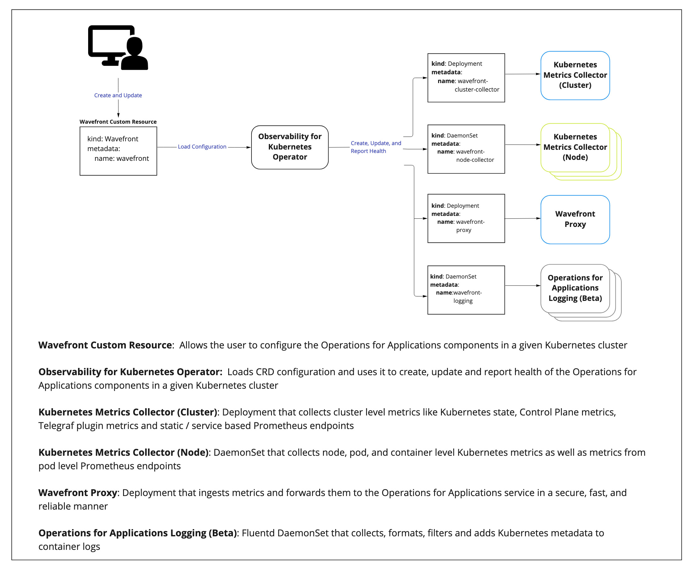

# Overview of the Observability for Kubernetes Operator

The Observability for Kubernetes Operator deploys the necessary agents to monitor your clusters and workloads in Kubernetes.
This Operator is based on [kubebuilder SDK](https://book.kubebuilder.io/).

**Important:** Logs (Beta) is enabled only for selected customers. If you’d like to participate, contact your Observability account representative.

## Quick Reference
- [Operator Installation](#installation)
- [Operator Configuration](#configuration)
- [Operator Upgrade](#upgrade)
- [Operator Downgrade](#downgrade)
- [Operator Removal](#removal)

## Why Use the Observability for Kubernetes Operator?

The Operator simplifies operational aspects of managing the Kubernetes Integration for VMware Aria Operations for Applications (formerly known as Tanzu Observability by Wavefront). Here are some examples, with more to come!
 - Enhanced status reporting of the Kubernetes Integration so that users can ensure their cluster and Kubernetes resources are reporting data.
 - Kubernetes Operator features provide a declarative mechanism for deploying the necessary agents in a Kubernetes environment.
 - Centralized configuration.
 - Enhanced configuration validation to surface what needs to be corrected in order to deploy successfully.
 - Efficient Kubernetes resource usage supports scaling  out the cluster (leader) node and worker nodes independently.

**Note:** The Kubernetes Metrics Collector that is deployed by this Operator still supports configuration via configmap.
For example, Istio and MySQL metrics, Telegraf configuration, etc. are still supported. For details on the Collector, see [collector.md](docs/collector/collector.md).

## Architecture



# Installation

**Note:**  The Observability for Kubernetes Operator Helm chart is deprecated and no longer supported. Use the deploy, upgrade, and removal instructions below instead.

## Prerequisites

To install the integration, you must use the [kubectl](https://kubernetes.io/docs/tasks/tools/) tool.


## Deploy the Monitoring Agents with the Observability for Kubernetes Operator

1. Install the Observability for Kubernetes Operator into the `observability-system` namespace.

   **Note**: If you already have the deprecated Kubernetes Integration installed by using Helm or manual deployment, *uninstall* it before you install the Operator.
 
   ```
kubectl apply -f https://github.com/wavefrontHQ/observability-for-kubernetes/releases/download/CURRENT_VERSION/wavefront-operator.yaml
   ```

2. Create a Kubernetes secret with your Wavefront API token.
   See [Managing API Tokens](https://docs.wavefront.com/wavefront_api.html#managing-api-tokens) page.
   ```
   kubectl create -n observability-system secret generic wavefront-secret --from-literal token=YOUR_WAVEFRONT_TOKEN
   ```
3. Create a `wavefront.yaml` file with your `Wavefront` Custom Resource configuration.  The simplest configuration is:
   ```yaml
   # Need to change YOUR_CLUSTER_NAME and YOUR_WAVEFRONT_URL
   apiVersion: wavefront.com/v1alpha1
   kind: Wavefront
   metadata:
     name: wavefront
     namespace: observability-system
   spec:
     clusterName: YOUR_CLUSTER_NAME
     wavefrontUrl: YOUR_WAVEFRONT_URL
     dataCollection:
       metrics:
         enable: true
     dataExport:
       wavefrontProxy:
         enable: true
   ```
   See the [Configuration](#configuration) section below for details.

4. (Logging Beta) **Optionally** add the configuration for logging to the `wavefront.yaml` file. For example: 

   ```yaml
   # Need to change YOUR_CLUSTER_NAME, YOUR_WAVEFRONT_URL accordingly
   apiVersion: wavefront.com/v1alpha1
   kind: Wavefront
   metadata:
     name: wavefront
     namespace: observability-system
   spec:
     clusterName: YOUR_CLUSTER_NAME
     wavefrontUrl: YOUR_WAVEFRONT_URL
     dataCollection:
       metrics:
         enable: true
       logging:
         enable: true
     dataExport:
       wavefrontProxy:
         enable: true
   ```
   See [Logs Overview (Beta)](https://docs.wavefront.com/logging_overview.html) for an overview and some links to more doc about the logging beta.
   
   See [Bring Your Own Logs Shipper](#bring-your-own-logs-shipper) for an overview of how to use the Operator with your own logs shipper.

5. Deploy the agents with your configuration
   ```
   kubectl apply -f <path_to_your_wavefront.yaml>
   ```
6. Run the following command to get status of the Kubernetes integration:
   ```
   kubectl get wavefront -n observability-system
   ```
   The command should return a table like the following, displaying Operator instance health:
   ```
   NAME        STATUS    PROXY           CLUSTER-COLLECTOR   NODE-COLLECTOR   LOGGING        AGE    MESSAGE
   wavefront   Healthy   Running (1/1)   Running (1/1)       Running (3/3)    Running (3/3)  2m4s   All components are healthy
   ```
   If `STATUS` is `Unhealthy`, check [troubleshooting](docs/troubleshooting.md).

**Note**: For details on migrating from existing helm chart or manual deploy, see [Migration](docs/operator/migration.md).

# Configuration

You configure the Observability for Kubernetes Operator with a custom resource file.

When you update the resource file,
the Operator picks up the changes and updates the integration deployment accordingly.

To update the custom resource file:
- Open the custom resource file for edit.
- Change one or more options and save the file.
- Run `kubectl apply -f <path_to_your_config_file.yaml>`.

See below for configuration options.

We have templates for common scenarios. See the comments in each file for usage instructions.

 * [Using a custom private registry](deploy/scenarios/wavefront-custom-private-registry.yaml)
 * [With plugin configuration in a secret](deploy/scenarios/wavefront-collector-with-plugin-secret.yaml)
 * [Filtering metrics upon collection](deploy/scenarios/wavefront-collector-filtering.yaml)
 * [Disabling control plane metrics](deploy/scenarios/wavefront-disable-control-plane-metrics.yaml)
 * [Collecting metrics from ETCD](deploy/scenarios/wavefront-control-plane-with-etcd-certs.yaml)
 * [Defining Kubernetes resource limits](deploy/scenarios/wavefront-pod-resources.yaml)
 * [Defining data collection pod tolerations](deploy/scenarios/wavefront-daemonset-pod-tolerations.yaml)
 * [Defining proxy pre-processor rules](deploy/scenarios/wavefront-proxy-preprocessor-rules.yaml)
 * [Enabling proxy histogram support](deploy/scenarios/wavefront-proxy-histogram.yaml)
 * [Enabling proxy tracing support](deploy/scenarios/wavefront-proxy-tracing.yaml)
 * [Using an HTTP Proxy](deploy/scenarios/wavefront-proxy-with-http-proxy.yaml)
 * [Getting started with logging configuration](deploy/scenarios/wavefront-logging-getting-started.yaml)
 * [Full logging configuration](deploy/scenarios/wavefront-logging-full-config.yaml)
 * [Bring your own logs shipper](deploy/scenarios/wavefront-bring-your-own-logs-shipper.yaml)

You can see all configuration options in the [wavefront-full-config.yaml](deploy/scenarios/wavefront-full-config.yaml).

## Creating Alerts

We have alerts on common Kubernetes issues. For details on creating alerts, see [alerts.md](docs/alerts/alerts.md).

### Observability Failures

| Alert name | Description |
|---|---|
| [Observability Status is Unhealthy](docs/alerts/templates/observability-status-unhealthy.json.tmpl) | The status of the Observability for Kubernetes is unhealthy. |

### Pod Failures

| Alert name | Description |
|---|---|
| [Pod Stuck in Pending](docs/alerts/templates/pod-stuck-in-pending.json.tmpl) | Workload has pod stuck in pending. |
| [Pod Stuck in Terminating](docs/alerts/templates/pod-stuck-in-terminating.json.tmpl) | Workload has pod stuck in terminating. |
| [Pod Backoff Event](docs/alerts/templates/pod-backoff-event.json.tmpl) | Workload has pod with container status `ImagePullBackOff` or `CrashLoopBackOff`. |
| [Workload Not Ready](docs/alerts/templates/workload-not-ready.json.tmpl) | Workload has pods that are not ready. |
| [Pod Out-of-memory Kills](docs/alerts/templates/pod-out-of-memory-kills.json.tmpl) | Workload has pod with container status `OOMKilled`. |
| [Container CPU Throttling](docs/alerts/templates/container-cpu-throttling.json.tmpl) | Workload has a container with high CPU throttling. |
| [Container CPU Overutilization](docs/alerts/templates/container-cpu-overutilization.json.tmpl) | Workload has a container with high CPU utilization. |
| [Container Memory Overutilization](docs/alerts/templates/container-memory-overutilization.json.tmpl) | Workload has a container with high memory utilization. |
| [Missing etcd leader](templates/etcd-no-leader.json.tmpl) | etcd cannot elect a leader. |

### Persistent Volume Failures

| Alert name | Description |
|---|---|
| [Persistent Volumes No Claim](docs/alerts/templates/persistent-volumes-no-claim.json.tmpl) | Persistent Volume has no claim. |
| [Persistent Volumes Error](docs/alerts/templates/persistent-volumes-error.json.tmpl) | Persistent Volume has issues with provisioning. |
| [Persistent Volume Claim Overutilization](docs/alerts/templates/persistent-volume-claim-overutilization.json.tmpl) | Workload has low available disk space for a claimed Persistent Volume. |

### Node Failures

| Alert name                                                                                         | Description |
|----------------------------------------------------------------------------------------------------|-------------|
| [Node Memory Overutilization](docs/alerts/templates/node-memory-overutilization.json.tmpl)         | Node has high memory utilization. |
| [Node CPU Overutilization](docs/alerts/templates/node-cpu-overutilization.json.tmpl)               | Node has high CPU utilization. |
| [Node Filesystem Overutilization](docs/alerts/templates/node-filesystem-overutilization.json.tmpl) | Node storage is almost full. |
| [Node CPU-request Saturation](docs/alerts/templates/node-cpu-request-saturation.json.tmpl) | Node has overcommitted cpu resource requests. |
| [Node Memory-request Saturation](docs/alerts/templates/node-memory-request-saturation.json.tmpl) | Node has overcommitted memory resource requests. |
| [Node Disk Pressure](docs/alerts/templates/node-disk-pressure.json.tmpl) | Node has problematic `DiskPressure` condition. |
| [Node Memory Pressure](docs/alerts/templates/node-memory-pressure.json.tmpl) | Node has problematic `MemoryPressure` condition. |
| [Node Condition Not Ready](docs/alerts/templates/node-condition-not-ready.json.tmpl)               | Node Condition not in Ready state. |

## Bring Your Own Logs Shipper

The operator deploys a data export component (wavefront-proxy) which can receive log data and forward it to the Operations for Applications service.
You will need to configure your logs shipper to send logs to the data export component (wavefront-proxy) deployed by the Operator.

Here is a `Wavefront` Custom Resource [example config](deploy/scenarios/wavefront-bring-your-own-logs-shipper.yaml) for this scenario.

To make the best use of your logging solution on Kubernetes, we recommend having the below Kubernetes log attributes:

| Log attribute key   | Description                  |
|---------------------|------------------------------|
| `cluster`           | The kubernetes cluster name  |
| `pod_name`          | The pod name                 |
| `container_name`    | The container name           |
| `namespace_name`    | The namespace name           |
| `pod_id`            | The pod id                   |
| `container_id`      | The container id             |

In addition to these, here are some [general log attributes](https://docs.wavefront.com/logging_overview.html#log-attributes) to configure your logs shipper based on your use case.

# Upgrade

Upgrade the Observability for Kubernetes Operator and underlying agents to a new version by running the following command :

```
kubectl apply -f https://github.com/wavefrontHQ/observability-for-kubernetes/releases/download/NEW_VERSION/wavefront-operator.yaml
```

Note: This command will not upgrade any existing deprecated Helm or manual installations. See [migration.md](docs/operator/migration.md) for migration instructions.

# Downgrade

Go to [Releases](https://github.com/wavefrontHQ/observability-for-kubernetes/releases), and find the previous release version number, for example v2.0.3. Use this value to replace **PREVIOUS_VERSION** 
in the following command:

```

kubectl apply -f https://github.com/wavefrontHQ/observability-for-kubernetes/releases/download/PREVIOUS_VERSION/wavefront-operator.yaml
```

# Removal

To remove the Observability for Kubernetes Operator from your environment, run the following command:

```
kubectl apply -f https://github.com/wavefrontHQ/observability-for-kubernetes/releases/download/CURRENT_VERSION/wavefront-operator.yaml
```

# Contribution

See the [Contribution page](docs/contribution.md)
