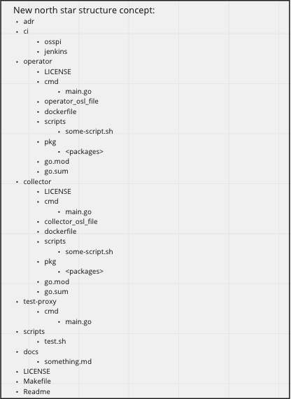
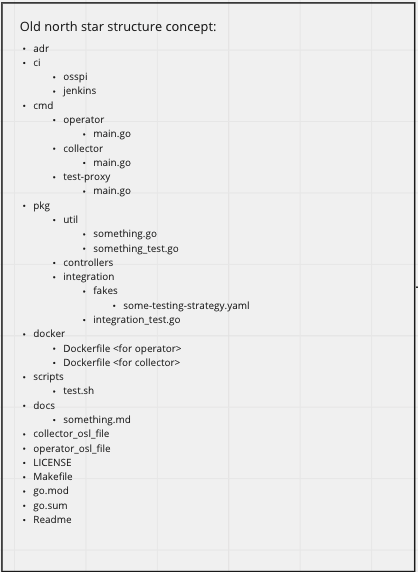

# MonoRepo structure for the observability k8s Operator and its metrics collection component

## Context

Previously, there were two separate repos for the k8s operator(wavefront-operator-for-kuberentes) and the k8s metrics collection component(wavefront-collector-for-kubernetes). The team realized that having a monorepo that contains the k8s related components would make for tighter integration testing and faster development cycles. This adr focuses on the north star structure for the mono repo.

## Decision
We eventually decided on the below structure:

The team refactored to achieve some of the structure from the above architecture diagram, mainly
- Bring specific files and folders (docs/adr/README/LICENSE) under repo root.
- Bringing ci under repo root.
- Bringing common scripts under repo root

## Status
- Ongoing work tracked with [miro board](https://miro.com/app/board/uXjVP1_mAVI=/)

## Consequences
- Decreases development time and effort required to make changes to multiple components and test them together.

  Example: 
  - Test operator with newly built collector in a single pipeline.
  - Adding integration tests to test-proxy and testing operator with the newly build test-proxy.

- Provides for a single place to document release notes for our components and reduces user confusion.

## Other options considered:
This is the original structure we came up with:

As we spiked on it, we realized the following pain points and decided to not go ahead with it:
- Maintaining multiple go versions is required due to kube-builder having a specific go version dependency.
